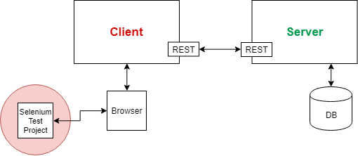

# FIT-Projekt

In unserem Schulprojekt werden wir die Firmen-Informations-Tags Seite Testen um Fehler bei den Kunden zu vermeiden.
Hierbei wird automatisiert getestet (mit Selenium - Regressionstest), genauso wie manuell, da es sich bei manchen Use-Cases nicht lohnt sie zu automatisieren (Beispielsweise Admintool) 

Als Test-Browser wird Google Chrome benützt - mit dem Chrome Webdriver von Selenium 

### Wir testen das Projekt mit einem ausenstehenden Java Selenium Programm

  

**[Systemarchitektur](Images/FitWebsite.png)**

## :gear: Setup 
Für die Installationen wird der **[Node Package Manager](https://nodejs.org/en/download/)** benötigt 
### Client (Angular Applikation)
Die benötigten Dependencies bekommen:\
`npm install`  
Client starten:\
`ng serve`

### Server  (Visual Studio Solution)
Wenn Datenbank nicht aktuell, `Update-Database` in der NuGet Package Manager Console ausführen
- Im Startup.cs muss **InitDb(provider);** auskommentiert sein damit das Update-Command
funktioniert. Danach wieder entkommentieren damit Testdaten erstellt werden.
- wenn Model nicht up-to-date zuvor noch eine Migration erstellen: `Add-Migration`

In Visual Studio oben **Backend** auswählen und ausführen.

### [Protractor](https://www.protractortest.org/#/) 
(befindet sich im [Client](https://github.com/nicoVasq/FIT-Projekt/tree/Development/Test%20Client/Protractor/fit-client-testing) - Angular Projekt)  
Protractor is ein end-to-end testing Framework für Angular/Angular JS Applikationen.\
Wir benützt die Syntax von dem [Jasmine](https://jasmine.github.io/) Framework.
- **Protractor-Setup:**
    
    Mit **[Npm (+Node JS)](https://nodejs.org/en/download/)** Protractor + Jasmine installieren:
    ```
    # Local installation:
    npm install --save-dev protractor

    #Global installation:
    npm install -g protractor
    ```
    ```
    npm install --save @types/jasminewd2
    ```
    Selenium standalone server (wird von Protractor benötigt):
    ```
    webdriver-manager update
    ```
    Benötigte Library:
    ```
    npm install --save @types/core-js
    ```

Tests werden ausgeführt mit `protractor protractor.conf.js`

### [Selenium Client](https://github.com/nicoVasq/FIT-Projekt/tree/Development/Test%20Client/Selenium)
Benötigt:

- **[Selenium Standalone Server](https://www.seleniumhq.org/download/)**  
- **[Chrome Webdriver](http://chromedriver.chromium.org/downloads)** (verwendet wird Selenium mit **Google Chrome**)


## Änderungsprotokoll

Die Änderungen konnen [hier](./CodeChangesProtocol.md) eingesehen werden


## Wir programmieren mit ...
 

## :art: Plakat


